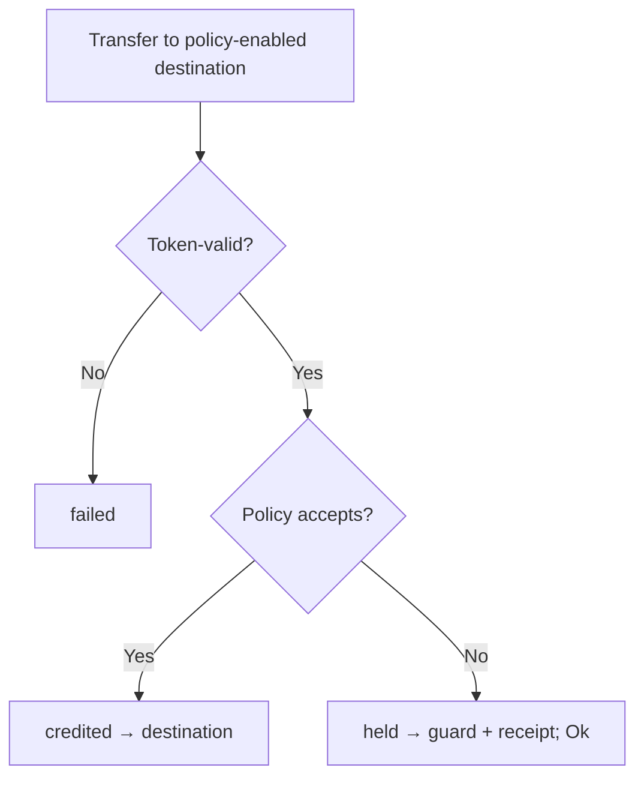

# solana-receive

Receiver-side **held delivery** for Token-2022-shaped token accounts: an opt-in destination `ReceivePolicy` that can credit, fail, or route non-matching transfers into a receiver-scoped guard with a claimable receipt — without reverting the outer transfer for policy rejection alone.

Greenfield **custom program ID** reference. Not canonical Token-2022. **Not wire-compatible** with `TokenzQd…` instruction tags. Does not intercept legacy Tokenkeg USDC/USDT.

## Why

Ordinary SPL / Token-2022 transfers credit a destination token account (usually an ATA). Receivers lack a protocol-native way to:

1. Attach inbound acceptance rules to that account,
2. Keep the transfer successful when policy rejects, and
3. Recover rejected amounts via claim or expiry.

Mint Transfer Hooks are issuer-owned and typically revert. Account-side hooks discussed in [token-2022#124](https://github.com/solana-program/token-2022/issues/124) are approve/reject (revert). App `deposit()` vaults are cooperative rails — ordinary ATA transfers never enter them.

## Outcomes



| Outcome | Meaning | Return data |
| --- | --- | --- |
| `failed` | Ordinary token / account-resolution failure (atomic; no receipt) | — (tx reverts) |
| `credited` | Policy accepts → `source → destination` | `0` |
| `held` | Policy rejects → `source → guard` + receipt; instruction `Ok` | `1` |

`held` **succeeds**. Senders and indexers must read the outcome byte, not just transaction
success — otherwise a diverted payment reads as a delivered one. Held funds stay recoverable:
the guard's spending authority is a PDA, so the receiver cannot spend them, and recovery is
by `ClaimReceipt` or permissionless `CloseExpiredReceipt` after the TTL.

## Status / non-claims

| | |
| --- | --- |
| In tree | Reference program, host + LiteSVM suites, golden vectors, draft sRFC |
| Measured | CU ceilings + footprints under LiteSVM (see [docs/VERIFICATION.md](docs/VERIFICATION.md)) |
| Not claimed | Canonical Token-2022, TokenzQd wire compatibility, legacy USDC interception, full upstream extension parity, mainnet product |

## Tests

```bash
export PATH="$HOME/.local/share/solana/install/active_release/bin:$PATH"
cargo build-sbf --manifest-path program/token-2022-receive/Cargo.toml
cargo test -p token-2022-receive
```

Security-relevant regression suites: `guard_custody` (held funds unspendable by the receiver,
outcome reporting) and `policy_bounds` (write-once policy, mode validation, bond/TTL caps).

## Layout

```
program/token-2022-receive/   # Reference program (custom program ID)
clients/js/                   # Minimal instruction/PDA helpers
docs/SPEC.md                  # Normative v0 semantics
docs/VERIFICATION.md          # How to re-run evidence + measured CU
docs/proposals/               # sRFC, decision request, maintainer note, SIMD gate
scripts/                      # Optional Surfpool checklist
.upstream-token-2022-sha.txt  # Pinned upstream SHA for layout inspiration
```

## Program ID

Declared ID: `GyrTVV4hbcuzJuSz86FNq7K2UVAoSJQtcgHTVTz1hPPq`.  
Local `cargo build-sbf` may emit a different `target/deploy/*-keypair.json`; for Surfpool/deploy, use a keypair whose pubkey matches `declare_id!`, or regenerate both together. Never commit keypairs.

## Proposal path

1. [docs/SPEC.md](docs/SPEC.md) — normative reference behavior  
2. [docs/proposals/srfc-receive-policy-held-delivery.md](docs/proposals/srfc-receive-policy-held-delivery.md) — discussion draft  
3. [docs/proposals/decision-request.md](docs/proposals/decision-request.md) — mint flag / metas / greenfield / SIMD  
4. Maintainer discussion vs [#124](https://github.com/solana-program/token-2022/issues/124) (revert hook vs held delivery)  
5. SIMD **only if** maintainers confirm canonical Token-2022 / runtime scope  

License: [Apache-2.0](LICENSE). Program details: [program/token-2022-receive/README.md](program/token-2022-receive/README.md).
