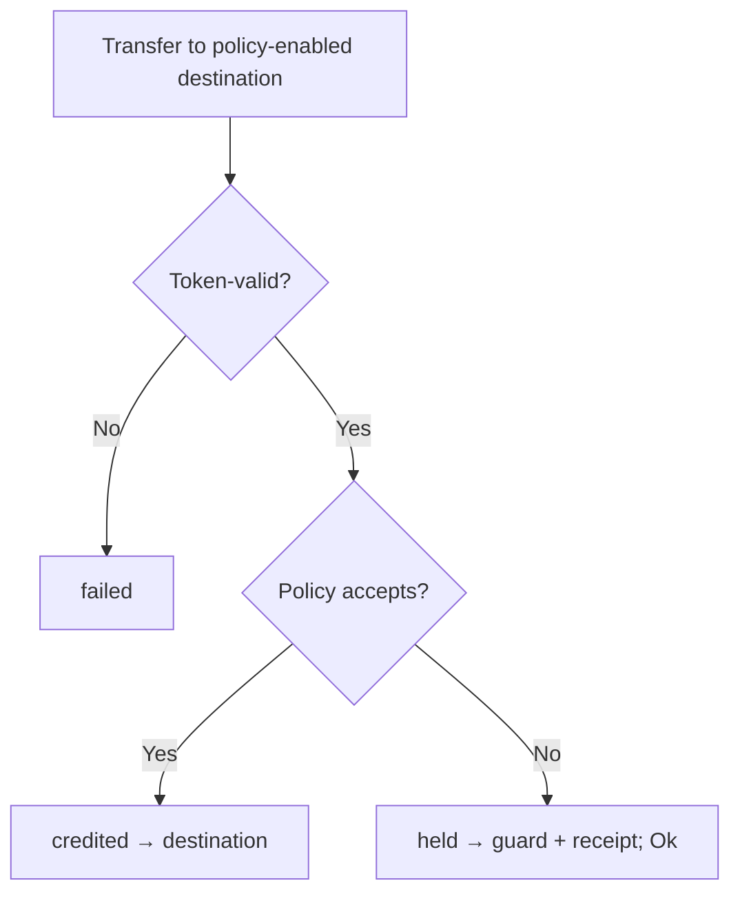

# solana-receive

This repo explores what happens when a token receiver can attach rules to an
incoming transfer. If the transfer is valid and accepted, it credits the receiver.
If token validation fails, the transfer fails. If the receiver's policy rejects it,
the funds are held in a receiver-scoped guard with a receipt instead of pretending
delivery happened. Operators should read [docs/OPERATOR.md](docs/OPERATOR.md)
before running demos or citing evidence.

The implementation is a **custom program ID** reference shaped like
Token-2022. It is not canonical Token-2022, is **not wire-compatible** with
`TokenzQd…` instruction tags, and does not intercept legacy Tokenkeg USDC/USDT.

## Why

Ordinary SPL / Token-2022 transfers credit a destination token account (usually an ATA). Receivers lack a protocol-native way to:

1. Attach inbound acceptance rules to that account,
2. Keep the transfer successful when policy rejects, and
3. Recover rejected amounts via claim or expiry.

Mint Transfer Hooks are issuer-owned and typically revert. Account-side hooks discussed in [token-2022#124](https://github.com/solana-program/token-2022/issues/124) are approve/reject (revert). App `deposit()` vaults are cooperative rails — ordinary ATA transfers never enter them.

## Outcomes



| Outcome | Meaning | Return data |
| --- | --- | --- |
| `failed` | Ordinary token / account-resolution failure (atomic; no receipt) | - (tx reverts) |
| `credited` | Policy accepts → `source → destination` | `0` |
| `held` | Policy rejects → `source → guard` + receipt; instruction `Ok` | `1` |

`held` **succeeds**. Senders and indexers must read the outcome, not just transaction success -
otherwise a diverted payment reads as a delivered one. A sender that will not accept held
delivery at all can send with `HeldLimits::no_hold()`, which turns a policy rejection into a
plain failure, and `previewOutcome` in the JS client says which outcome a transfer will get
before it is sent. Held funds stay recoverable:
the guard's spending authority is a PDA, so the receiver cannot spend them, and recovery is
by `ClaimReceipt` or permissionless `CloseExpiredReceipt` after the TTL. A guard is refused as
a transfer or mint destination, since tokens reaching it outside the held path would carry no
receipt and could never be recovered.

## Status / non-claims

| | |
| --- | --- |
| In tree | Reference program, host + LiteSVM suites, golden vectors, Codama/Kit JS client, Surfpool demo |
| Measured | CU ceilings + footprints under LiteSVM (see [docs/VERIFICATION.md](docs/VERIFICATION.md)) |
| Not claimed | Canonical Token-2022, TokenzQd wire compatibility, legacy USDC interception, full upstream extension parity, mainnet product, any upgrade or migration path |

## Prerequisites

```bash
sh -c "$(curl -sSfL https://release.anza.xyz/v4.1.1/install)"
export PATH="$HOME/.local/share/solana/install/active_release/bin:$PATH"
node --version # 22+ recommended for strip-types client tests
```

See [docs/OPERATOR.md](docs/OPERATOR.md) for the full smoke path, Surfpool pin,
and declared-ID vs local deploy-keypair story.

## Tests

```bash
./scripts/smoke.sh
```

Expect exit 0. The wrapper runs the Rust/SBF gates plus root `npm ci`,
`npm run codegen:check`, and the JS client suite (`cd clients/js && npm ci &&
npm test`); the JS suite currently reports 17 passing.

Security-relevant regression suites: `guard_custody` (held funds unspendable by the receiver,
outcome reporting) and `policy_bounds` (write-once policy, mode validation, bond/TTL caps).

## Layout

```
program/token-2022-receive/   # Reference program (custom program ID)
clients/js/                   # Kit/Codama client (generated + residual helpers)
idl/                          # Codama IDL (source for client codegen)
docs/SPEC.md                  # Normative v0 semantics
docs/WIRE.md                  # Frozen byte/account contract for codegen
docs/VERIFICATION.md          # How to re-run evidence + measured CU
docs/OPERATOR.md              # Smoke checklist + declared-ID vs local keypair
docs/proposals/               # sRFC, decision request, maintainer note, SIMD gate
scripts/                      # smoke.sh, Surfpool lifecycle, codegen helpers
demos/receive/                # Honest Surfpool demo UI (custom program/mint)
.upstream-token-2022-sha.txt  # Pinned upstream SHA for layout inspiration
```

## Program ID

Declared ID: `GyrTVV4hbcuzJuSz86FNq7K2UVAoSJQtcgHTVTz1hPPq`.

Local `cargo build-sbf` usually emits a **different** `target/deploy/*-keypair.json`. The Surfpool
lifecycle deploys that local keypair and passes `RECEIVE_PROGRAM_ID` into the Kit client. A green
demo is fidelity evidence under that override; it is **not** proof of declared-ID deployability
without the matching secret. Full story: [docs/OPERATOR.md](docs/OPERATOR.md). Never commit keypairs.

## Operator smoke

```bash
./scripts/smoke.sh                    # build-sbf + Rust tests + JS client
./scripts/surfpool-lifecycle.sh       # manual RPC (Surfpool 1.5.0); see OPERATOR.md
```

## Proposal path

1. [docs/SPEC.md](docs/SPEC.md) — normative reference behavior
2. [docs/proposals/srfc-receive-policy-held-delivery.md](docs/proposals/srfc-receive-policy-held-delivery.md) — discussion draft
3. [docs/proposals/decision-request.md](docs/proposals/decision-request.md) — mint flag / metas / custom reference / SIMD
4. Maintainer discussion vs [#124](https://github.com/solana-program/token-2022/issues/124) (revert hook vs held delivery)
5. SIMD **only if** maintainers confirm canonical Token-2022 / runtime scope

License: [Apache-2.0](LICENSE). Program details: [program/token-2022-receive/README.md](program/token-2022-receive/README.md).
