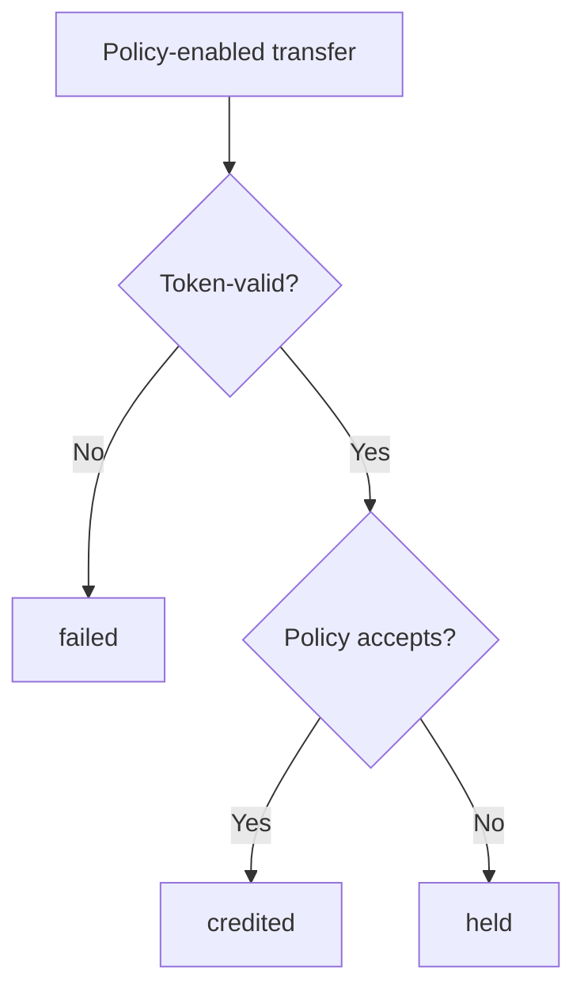

# Receive Policy — Specification (v0 reference)

Normative for the **custom program ID** reference program in this repository.  
Not a claim of canonical Token-2022 or legacy Tokenkeg USDC/USDT interception.  
**Not wire-compatible** with `TokenzQd…` instruction discriminators (Token-2022-**shaped** layouts and no-policy transfer semantics only).

## 1. Purpose

Define destination-account receive-policy semantics with three transfer outcomes: `failed`, `credited`, and `held`. Held delivery is distinct from mint Transfer Hooks and from account-side approve/reject hooks ([token-2022#124](https://github.com/solana-program/token-2022/issues/124)), which revert on disapproval.

## 2. Constraints (load-bearing)

1. **Ordinary ATA transfers bypass app vaults.** A cooperative `deposit()` only governs funds sent through it.
2. **Balances are per token account / mint.** Policy attaches to one destination account for one mint — not a chain-wide wallet bag.
3. **Explicit account lists.** Policy/guard/receipt accounts must be listed when the extension is present. Missing metas → `failed`, never silent bypass.
4. **No global writable guard.** Held custody shards by `(receiver_owner, mint)`; program scoping comes from the PDA's program id, not a seed.
5. **Membership = source token-account owner.** Delegates may authorize transfers; allowlist checks still use the source owner. Permanent delegate is issuer power (documented), not an allowlisted “sender.”

## 3. Approach

| Approach | Verdict |
| --- | --- |
| App-layer policy `deposit()` as ambient policy | Rejected for equivalence claims; optional demo adapter only |
| Mint Transfer Hook as primary receive policy | Rejected — wrong ownership, revert-only, read-only hook accounts |
| Custom Token-2022-shaped program: receive-policy in transfer processing | **Chosen** (reference program ID) |
| sRFC first; SIMD only if canonical/runtime scope confirmed | **Chosen** |

## 4. Policy scope and fields

Policy attaches to a **destination token account** owned by this program. Accounts without the extension keep ordinary transfer behavior (4-account `TransferChecked`).

| Field | Meaning |
| --- | --- |
| `min_amount` | Minimum accepted amount (`0` = no floor) |
| `source_owner_mode` | `AllowAll` \| `Allowlist` |
| `source_owner_allowlist` | Up to **8** pubkeys (v0 in-account cap) |
| `recovery_authority` | Who may claim held receipts |
| `receipt_bond_lamports` | Bond/rent reserved per open receipt |
| `receipt_ttl_slots` | Expiry window (default **1_512_000** ≈ 7 days) |

Acceptance (v0):

```
amount >= min_amount
AND (AllowAll OR source_owner ∈ allowlist)
```

The policy is **write-once**. `InitializeReceivePolicy` fails on an account that already
carries the extension, so a destination cannot rewrite acceptance rules between a sender's
quote and the sender's transaction. Mode bytes outside the defined ranges are rejected at
init rather than decoded permissively at transfer time.

**v0 reference defaults (locked in code):**

| Parameter | Value |
| --- | --- |
| Open receipts per shard | **Unbounded** (see below) |
| `MAX_RECEIPT_BOND_LAMPORTS` | 1 SOL (`1_000_000_000`) |
| `MAX_RECEIPT_TTL_SLOTS` | `6_480_000` ≈ 30 days |
| Receipt PDA | `(receiver, mint, source_owner, unique_nonce)` |
| Bond payer | Explicit instruction account (typically fee payer) |
| Expiry settlement | Return full amount to **source_owner** same-mint token account; refund bond |
| Mint allow-flag | **Not required** in this reference default |
| Transfer Hook coexistence | Unsupported / fail in v0 (enforced: any other account extension → `failed`) |
| Zero-amount held transfer | `failed` (would burn a shard slot while moving nothing) |
| `Approve` / `Revoke` | Not implemented in v0; `delegate` is always unset |
| `CloseAccount` | Not implemented; `close_authority` on a guard is a shard marker, not an authority |
| `InitializeMint2` signer | None, matching SPL. Clients MUST create and initialize a mint in one transaction, or another party can initialize it first with their own authority |

`receipt_bond_lamports` and `receipt_ttl_slots` are chosen by the **receiver** but paid for by
the **sender** - the bond is debited from `bond_payer` and the TTL decides how long a rejected
transfer stays locked. The protocol caps both, and each sender may additionally declare its own
ceilings per transfer (SPEC section 5.1). A destination can always refuse a payment; it must not
be able to set the price of refusing.

**No per-shard receipt cap.** An earlier draft bounded open receipts per `(receiver, mint)`.
That bound was a shared, permissionless resource: anyone could exhaust it and deny every other
sender held delivery until the receipts expired, for nothing but refundable bond. It protected
nobody in exchange, because the bond payer funds each receipt's rent (never the receiver) and no
instruction enumerates receipts. Each receipt being self-funding is the actual defence against
rent griefing; `GuardState.held_amount` is what makes custody verifiable.

## 5. Outcomes

### `failed`

Ordinary token or account-resolution failure (insufficient funds, freeze, decimals, missing policy metas, incompatible extensions, or a hold outside the sender's declared limits). Balances unchanged. No receipt.

### `credited`

Policy accepts → amount credited to destination. No receipt. Instruction succeeds.

### `held`

Policy rejects an otherwise token-valid transfer → amount routes **source → guard**; receipt created; destination unchanged; instruction `Ok`.

Because `held` succeeds, the instruction reports the outcome two ways: a `msg!` log line, and
one byte of **return data** (`0` credited, `1` held). On `held` the log also carries the receipt
address, amount and `expires_slot`, so an off-chain consumer can attribute the hold and find the
account to claim without scanning. A caller that checks only whether the
transaction landed will read a held transfer as a delivered payment; integrators MUST read the
outcome.

Return data is a single transaction-scoped slot that the runtime clears when the next
instruction begins, so only the last instruction's byte survives a multi-instruction
transaction. It is authoritative for a **CPI caller**, which reads it immediately. Off-chain
consumers of a multi-instruction transaction should read the per-instruction log line, or the
destination balance, instead of assuming the byte belongs to their transfer.

### 5.1 Sender-declared held limits

`TransferChecked` carries `max_bond_lamports` and `max_ttl_slots`. If a policy rejection would
create a receipt whose bond or TTL exceeds them, the instruction **fails** instead of holding.

| Limits | Meaning |
| --- | --- |
| `HeldLimits::unlimited()` | Accept whatever the destination's policy says |
| `HeldLimits::no_hold()` | Never hold: a policy rejection becomes `failed` and the sender keeps the funds |
| `HeldLimits::originator_recovery_only()` | Hold only while the sender remains the recovery authority |
| Explicit values | Hold only on the sender's terms |

`max_recovery_mode` bounds custody, not cost: under `Receiver` or `ThirdParty` recovery the party
that rejected the payment also chooses who may claim it, so a sender that caps only bond and TTL
has still handed the destination discretion over the funds.

Limits bound the **held** outcome only. A transfer the policy accepts is credited regardless.



## 6. Held custody

- Guard token + guard-state PDAs per `(receiver_owner, mint)`.
- On `held`, move tokens source → guard in transfer processing (no app Deposit/Escrow hop).
- `GuardState` records `open_receipts` and `held_amount`, the sum of every open receipt's amount
  in the shard. `guard_token.amount >= held_amount` is **asserted** after every deposit and every
  settlement, so a divergence fails closed where it is introduced rather than surfacing later as
  one sender being unable to claim.

**Custody authority (load-bearing).** The guard token account's owner field is the
`guard_state` PDA - *not* the receiver. No keypair can sign for it, so the only debit paths
are `ClaimReceipt` and `CloseExpiredReceipt`. The receiver is the party whose policy rejected
the transfer, and is therefore exactly the party held custody must be protected against;
making the receiver the guard's spending authority would let one signature confiscate every
sender's held balance in the shard.

A guard is also refused as either endpoint of **any** `TransferChecked` and as a `MintTo`
target. Tokens that reach a guard outside the held path carry no receipt, so neither claim nor
expiry can move them out again: crediting a guard destroys the funds, and the instruction would
otherwise have reported `credited` for it. Guards are recognised in constant time on the
ordinary path, because `EnsureGuard` records the shard's receiver in the otherwise unused
`close_authority` field as a marker and nothing else in this program ever sets one.

## 7. Receipt lifecycle

**Create (on held):** record amount, mint, source/dest accounts, owners, recovery mode, slots, bond, bond payer, nonce.

**Claim:** recovery authority only; **full amount** guard → caller destination (same mint); close receipt; refund bond. No partial claims in v0.

| Recovery mode | Claim signer |
| --- | --- |
| `Originator` | Recorded `source_owner` |
| `Receiver` | `receiver_owner` |
| `ThirdParty` | Explicit pubkey in policy |

**Expiry:** after `expires_slot`, anyone may close; tokens return to a **source_owner** same-mint token account; bond **must** refund only to the recorded `bond_payer` (permissionless closer cannot redirect bond lamports).

## 8. Account resolution (policy transfer)

`TransferChecked` instruction data is **59** bytes: tag, `amount`, `decimals`, `unique_nonce`,
`max_bond_lamports`, `max_ttl_slots`, `max_recovery_mode`.

When destination has ReceivePolicy, `TransferChecked` requires **9** accounts:

1. source (w)  
2. mint  
3. destination (w)  
4. authority (signer)  
5. guard_token (w)  
6. guard_state (w)  
7. receipt (w)  
8. bond_payer (signer, w)  
9. system_program  

`ClaimReceipt` = 7 accounts; `CloseExpiredReceipt` = 6.

**Exception.** A transfer whose source and destination are the same account is a validated no-op,
matching SPL Token. It takes the 4-account form even when the destination carries a policy, does
not evaluate the policy, and reports `credited`: no balance changes, so there is nothing to
divert and nothing to hold.

## 9. Compatibility (v0 reference)

| Feature | Status |
| --- | --- |
| No other extensions | Supported |
| Transfer Fee / Memo / Freeze / Permanent Delegate / CPI Guard / Non-Transferable | Deferred or documented; not fully exercised |
| Mint Transfer Hook | Unsupported with receive-policy in v0 |
| Confidential Transfer | Incompatible (v0) |
| Legacy Tokenkeg USDC/USDT | Out of scope |

## 10. Threat model (summary)

The adversary this design must survive is the **receiver**: held custody exists precisely
because the receiver rejected the transfer, so every guard-side control assumes the
destination owner is hostile.

| Threat | Mitigation |
| --- | --- |
| **Receiver spends held custody directly** | Guard token authority is the `guard_state` PDA (unsignable) |
| **Funds destroyed by crediting a guard directly** | Guard refused as a transfer endpoint and as a `MintTo` target, on every path |
| **Policy rewritten mid-flight to seize an in-flight payment** | Policy is write-once |
| **Receiver-set bond / TTL used to grief the sender** | Protocol caps, plus per-transfer sender-declared limits (section 5.1) |
| **Held delivery forced on an unwilling sender** | `HeldLimits::no_hold()` makes a policy rejection fail instead |
| **Guard vault diverging from its open receipts** | `held_amount` asserted against the vault balance on every path |
| **Malformed policy TLV read as "no policy"** | Parse errors fail closed; only genuine absence credits |
| **Unknown mode byte degrading a policy to AllowAll** | Mode bytes parsed at init; unknown values rejected |
| **Held mistaken for credited by integrators** | Per-instruction `msg!` log, plus an outcome byte in return data (`0` credited, `1` held) |
| Undeclared extension coexistence | Any non-ReceivePolicy account extension → `failed` |
| Missing metas → silent bypass | Fail-closed |
| Global guard hotspot | Per-receiver shards |
| Receipt rent griefing | Depositor-funded bond + TTL (no shared capacity to exhaust) |
| Permissionless close steals bond | `bond_dest` must equal recorded `bond_payer` |
| Wrong guard accounts on claim/expiry | PDA + guard-state field checks (both transfer and claim paths) |
| Delegate / permanent-delegate confusion | Membership = source owner |
| USDC interception claims | Explicit non-claim |

### Residual risks (not mitigated in v0)

| Risk | Status |
| --- | --- |
| A hostile destination can still *route* an ordinary transfer into held custody by setting an unsatisfiable policy. Recovery is guaranteed (claim or expiry, both bounded), but the sender's funds are delayed, and under `Receiver` / `ThirdParty` recovery the destination decides who claims. **Senders must read the outcome byte, not just transaction success.** | By design; bounded by the TTL cap |
| A destination can still *route* a transfer into held custody by publishing an unsatisfiable policy. The policy is write-once, so a sender that reads it (`decodeReceivePolicy`, `previewOutcome` in the JS client) sees terms that cannot change, and declines with `HeldLimits::no_hold()`. A sender that reads nothing and passes `unlimited()` accepts whatever the destination wrote. | Mitigated; the remainder is an explicit sender choice |
| Throughput under a real scheduler is unmeasured. The account-lock structure is asserted (distinct shards share no writable account, `cu_ceilings::distinct_shards_share_no_writable_account`), but LiteSVM does not model bank locks. | Structure verified, throughput not |

## 11. Proposal path

sRFC discussion draft → maintainer discussion (#124 revert vs held) → SIMD **only if** canonical scope confirmed. See [proposals/](proposals/).

## 12. Canonical / upstream open questions

Unresolved for a future **canonical** Token-2022 path (reference defaults above may differ):

1. Whether a mint allow-flag should gate account-side receive-policy.
2. Exact ExtraAccountMeta / client resolution shape if upstream adopts the extension.
3. Whether a SIMD is required vs remaining a custom program ID reference.
