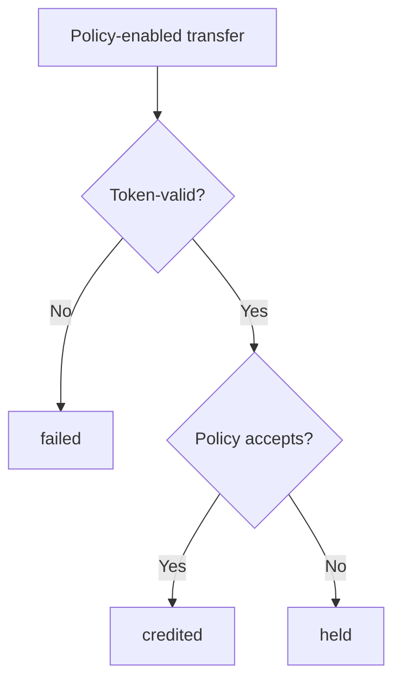

# Receive Policy — Specification (v0 reference)

Normative for the **custom program ID** reference program in this repository.  
Not a claim of canonical Token-2022 or legacy Tokenkeg USDC/USDT interception.  
**Not wire-compatible** with `TokenzQd…` instruction discriminators (Token-2022-**shaped** layouts and no-policy transfer semantics only).

## 1. Purpose

Define destination-account receive-policy semantics with three transfer outcomes: `failed`, `credited`, and `held`. Held delivery is distinct from mint Transfer Hooks and from account-side approve/reject hooks ([token-2022#124](https://github.com/solana-program/token-2022/issues/124)), which revert on disapproval.

## 2. Constraints (load-bearing)

1. **Ordinary ATA transfers bypass app vaults.** A cooperative `deposit()` only governs funds sent through it.
2. **Balances are per token account / mint.** Policy attaches to one destination account for one mint — not a chain-wide wallet bag.
3. **Explicit account lists.** Policy/guard/receipt accounts must be listed when the extension is present. Missing metas → `failed`, never silent bypass.
4. **No global writable guard.** Held custody shards by `(receiver_owner, mint, token_program)`.
5. **Membership = source token-account owner.** Delegates may authorize transfers; allowlist checks still use the source owner. Permanent delegate is issuer power (documented), not an allowlisted “sender.”

## 3. Approach

| Approach | Verdict |
| --- | --- |
| App-layer policy `deposit()` as ambient policy | Rejected for equivalence claims; optional demo adapter only |
| Mint Transfer Hook as primary receive policy | Rejected — wrong ownership, revert-only, read-only hook accounts |
| Custom Token-2022-shaped program: receive-policy in transfer processing | **Chosen** (reference program ID) |
| sRFC first; SIMD only if canonical/runtime scope confirmed | **Chosen** |

## 4. Policy scope and fields

Policy attaches to a **destination token account** owned by this program. Accounts without the extension keep ordinary transfer behavior (4-account `TransferChecked`).

| Field | Meaning |
| --- | --- |
| `min_amount` | Minimum accepted amount (`0` = no floor) |
| `source_owner_mode` | `AllowAll` \| `Allowlist` |
| `source_owner_allowlist` | Up to **8** pubkeys (v0 in-account cap) |
| `recovery_authority` | Who may claim held receipts |
| `receipt_bond_lamports` | Bond/rent reserved per open receipt |
| `receipt_ttl_slots` | Expiry window (default **1_512_000** ≈ 7 days) |

Acceptance (v0):

```
amount >= min_amount
AND (AllowAll OR source_owner ∈ allowlist)
```

**v0 reference defaults (locked in code):**

| Parameter | Value |
| --- | --- |
| `MAX_OPEN_RECEIPTS` | 64 per `(receiver, mint)` shard |
| Receipt PDA | `(receiver, mint, source_owner, unique_nonce)` |
| Bond payer | Explicit instruction account (typically fee payer) |
| Expiry settlement | Return full amount to **source_owner** same-mint token account; refund bond |
| Mint allow-flag | **Not required** in this reference default |
| Transfer Hook coexistence | Unsupported / fail in v0 |

## 5. Outcomes

### `failed`

Ordinary token or account-resolution failure (insufficient funds, freeze, decimals, missing policy metas, guard at capacity, incompatible extensions). Balances unchanged. No receipt.

### `credited`

Policy accepts → amount credited to destination. No receipt. Instruction succeeds.

### `held`

Policy rejects an otherwise token-valid transfer → amount routes **source → guard**; receipt created; destination unchanged; instruction `Ok`.



## 6. Held custody

- Guard token + guard-state PDAs per `(receiver_owner, mint)`.
- On `held`, move tokens source → guard in transfer processing (no app Deposit/Escrow hop).
- At capacity (`MAX_OPEN_RECEIPTS`), further policy-reject transfers **`failed`**.

## 7. Receipt lifecycle

**Create (on held):** record amount, mint, source/dest accounts, owners, recovery mode, slots, bond, bond payer, nonce.

**Claim:** recovery authority only; **full amount** guard → caller destination (same mint); close receipt; refund bond. No partial claims in v0.

| Recovery mode | Claim signer |
| --- | --- |
| `Originator` | Recorded `source_owner` |
| `Receiver` | `receiver_owner` |
| `ThirdParty` | Explicit pubkey in policy |

**Expiry:** after `expires_slot`, anyone may close; tokens return to a **source_owner** same-mint token account; bond **must** refund only to the recorded `bond_payer` (permissionless closer cannot redirect bond lamports).

## 8. Account resolution (policy transfer)

When destination has ReceivePolicy, `TransferChecked` requires **9** accounts:

1. source (w)  
2. mint  
3. destination (w)  
4. authority (signer)  
5. guard_token (w)  
6. guard_state (w)  
7. receipt (w)  
8. bond_payer (signer, w)  
9. system_program  

`ClaimReceipt` = 7 accounts; `CloseExpiredReceipt` = 6.

## 9. Compatibility (v0 reference)

| Feature | Status |
| --- | --- |
| No other extensions | Supported |
| Transfer Fee / Memo / Freeze / Permanent Delegate / CPI Guard / Non-Transferable | Deferred or documented; not fully exercised |
| Mint Transfer Hook | Unsupported with receive-policy in v0 |
| Confidential Transfer | Incompatible (v0) |
| Legacy Tokenkeg USDC/USDT | Out of scope |

## 10. Threat model (summary)

| Threat | Mitigation |
| --- | --- |
| Missing metas → silent bypass | Fail-closed |
| Global guard hotspot | Per-receiver shards |
| Receipt rent griefing | Bond + capacity + TTL |
| Permissionless close steals bond | `bond_dest` must equal recorded `bond_payer` |
| Wrong guard accounts on claim/expiry | PDA + guard-state field checks |
| Delegate / permanent-delegate confusion | Membership = source owner |
| USDC interception claims | Explicit non-claim |

## 11. Proposal path

sRFC discussion draft → maintainer discussion (#124 revert vs held) → SIMD **only if** canonical scope confirmed. See [proposals/](proposals/).

## 12. Canonical / upstream open questions

Unresolved for a future **canonical** Token-2022 path (reference defaults above may differ):

1. Whether a mint allow-flag should gate account-side receive-policy.
2. Exact ExtraAccountMeta / client resolution shape if upstream adopts the extension.
3. Whether a SIMD is required vs remaining a custom program ID reference.
